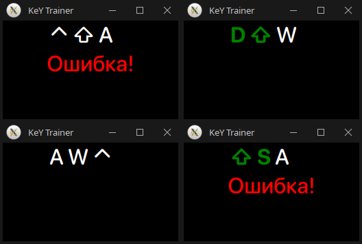

# Key Trainer

Simple trainer application using Python's Tkinter library. This program is designed for gamers who want to improve their muscle memory, keystroke speed, and overall finger dexterity, specifically for the W, A, S, D and Ctrl, Shift keys.

## Features

- Practice pressing specific keys in a randomly generated sequence keys.
- Receive immediate feedback on correctness, with visual indicators for successful and incorrect inputs.

## Installation

1. Ensure you have Python installed on your machine
2. Clone this repository:

   git clone https://github.com/judas-priest/key-trainer.git
   cd key-trainer

3. Run the application:

   python trainer.py

## Usage

- Start the app
- Press the keys displayed in the center of the window as quickly and accurately as possible
- The application will notify you if your input is correct or if you made an error

## License

This project is licensed under the MIT License.
